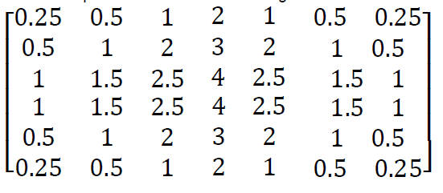

# Connect-4
Connect-4 game using pygame with AI using basic min max algorithm
|**#** |**NAME** |**ID** |
| - | - | - |
|**1** |**Hossam el-din ahmed** |**6721** |
|**2** |**Ehab sherif**  |**6738** |
|**3** |**Saeed el-sayed ahmed** |**6829** |

**HEURISTIC 1:** 

**We look for 4 kinds of different features from the board.** 

Feature 1: Absolute win 

Four chessmen are connected horizontally, vertically or diagonally  

Feature 2: Three connected chessmen 

Three chessmen are connected horizontally, vertically or diagonally 

Feature 3: Two connected chessmen 

Two chessmen are connected horizontally, vertically or diagonally 

Feature 4: Single chessman 

A chessman that is not connected to another same chessman horizontally, vertically or diagonally 

**Values assigned to different features.** 

Feature 1: A move can be made on either immediately adjacent columns 

100 

Feature 2: A move can only be made on one of the immediately adjacent columns  

-A same chessman can be found a square away from two connected men  -A move can be made on either immediately adjacent columns 

10 

Feature 3: A move can only be made on one of the immediately adjacent columns (The value depends on the number of available squares along the direction 

until an unavailable square is met) 

3 

Feature 4: Opponent can win in one move -5 

**HEURISTIC 2:** 

**To enforce the first heuristic, a second heuristic was made.** 

Different to heuristic 1, heuristic 2 doesn’t look for specific features on the board. Instead, it looks into every square on the board and gives them different 

evaluation values. If the square is more promising, it will get a higher value. The 

value for each square is shown in the following matrix. 

If the square is close to the middle column and row, it has a bigger value. For 

example, if a chessman is at (d, 3) or (d, 4), it has the biggest expansion space. It 

can form 4 connected men in its whole horizontal line, whole vertical line and 

whole diagonal line. However, if a chessman is put at (a, 1), it can only form 4 

connected men in its half horizontal line, half vertical line and half diagonal line. 

This square has much less possibility in forming 4 connected men than middle 

squares. Therefore, the values are corresponding to the square’s expansion space.** 

Test Cases: 

|
Depth(K) 

Time (Sec) 
|Nodes expanded |Minmax-without pruning |Minmax-with pruning |
| - | :- | - | - |
|2 |(49,27) |0.033655643463134766 |0.021992921829223633 |
|3 |(343,124) |0.21371078491210938 |0.08446097373962402 |
|4 |(2401,486) |1.3574693202972412 |0.29293155670166016 |
|5 |(16807, 1349)|8.915432453155518 |0.7848405838012695 |

[**Sample Run: depth =2 without pruning graph** ](https://drive.google.com/file/d/1wF3o7MbkJvjxARHUYHL9-Y6XEwoM3GGg/view?usp=share_link)

[**Sample run depth=2 with pruning ](https://drive.google.com/file/d/1ojTK65Y40q7Hcf7EwmkLPrjy4ITtu-1c/view?usp=share_link) **[Sample run depth= 4 with pruning ](https://drive.google.com/file/d/1Jsq9rb33npvTWnvLFwpbOG-q_DGEXcf2/view?usp=sharing)** 

[**Sample run depth= 4 without pruning ](https://drive.google.com/file/d/13RQXkBC2Iev9X7VkNFdiT3-0P_x283wm/view?usp=share_link)** 
